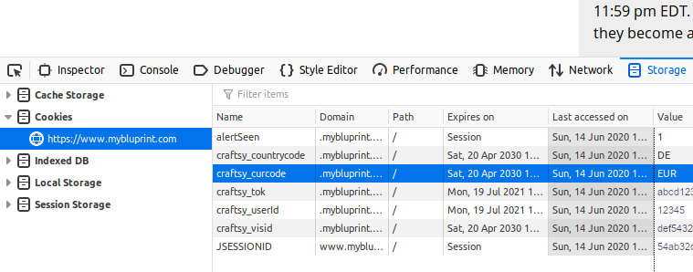

# Download classes from mybluprint.com

[mybluprint.com is closing](https://www.mybluprint.com/article/letter-to-our-bluprint-customers) and they are still thinking about how the lifetime purchased classes can be provided for the rest of their customer's life.

While there are some guides on how to download videos e.g.
  - using [Javascript and Bash](https://www.reddit.com/r/craftsnark/comments/goszlc/craftsybluprint_is_closing_soon/fs57qqm/)
  - or [using Allavsoft for $20](https://sewmodernbags.com/how-to-download-video-classes-from-bluprint-or-craftsy/)

I wanted some easy to use and free solution.

# How to use it

I didn't create an executable yet, so it's not as easy to use as I want it to be.

  1. [Download python3](https://www.python.org/downloads/) and install it
  2. Save downloadBluprint.py to the folder where the classes shall be downloaded to
  3. Put your cookies from mybluprint.com into downloadBluprint.py
  4. Run `python downloadBluprint.py`
  
## What the heck are cookies?

Step 3 probably is the most difficult one. As I didn't implement a login procedure, the script has to use the login data from your browser (e.g. Firefox or Chrome). After you have logged in on mybluprint.com your browser stores some information ("Cookie") to remember the log-in status. By giving the script this information it can access your classes.

### Firefox
  1. Log in on mybluprint.com (if you aren't already)
  2. Press F12 (i.e. open the developer console)
  3. Go to the Storage tab and open the Cookies section
     
     
  4. Copy the values from the table to the first lines in the script with the corresponding name

### Chrome

I don't use Chrome. Probably it is very similar to Firefox, but feel free to contribute.

### Edge

Probably very similar to Firefox, at least [according to this page](https://answers.microsoft.com/en-us/insider/forum/insider_internet-insider_spartan/how-to-view-and-manage-cookies-in-microsoft-edge/67b3a495-554e-4f1d-995e-93d0ea6882a6).

### Internet Explorer

[Perhaps this helps](https://stackoverflow.com/questions/19941029/how-do-i-view-cookies-in-internet-explorer-11-using-developer-tools)?

### others

see above. You can also search and ask the internet for help.

